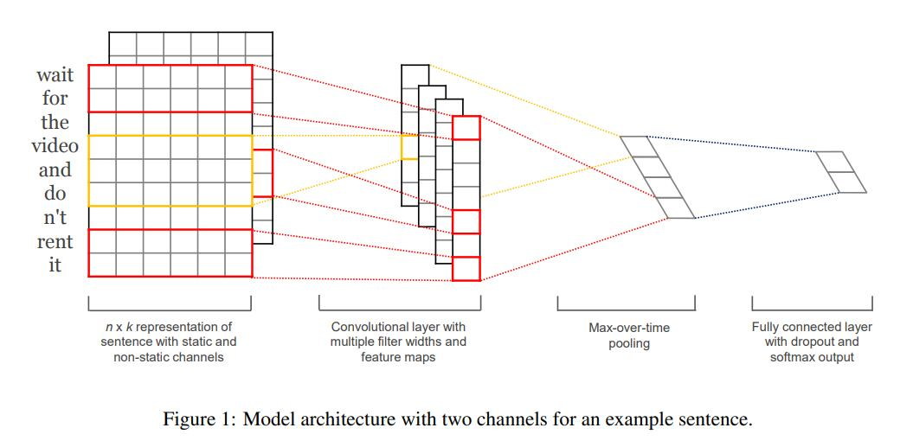
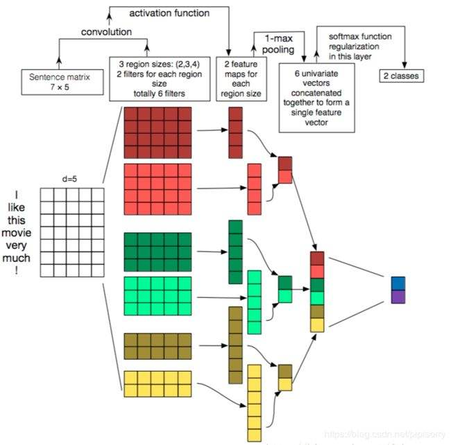

模型都未进行调参，未能使模型的准确率达到最高
# 项目名称：
使用 TextCNN 模型来对中文进行分类，即文本分类

# 项目环境：
pytorch、python   
相关库安装
```
pip install -r requirement.txt
```

# 项目目录：
TextCNN         
    |-- data                 数据集   
    |-- img                  相关图片            
    |-- model                保存的模型               
    |-- config.py            配置文件                                 
    |-- main.py              主函数                      
    |-- model.py             模型文件                     
    |-- predict.py           预测文件                         
    |-- requirement.txt      需要的安装包
    |-- test.py              测试文件
    |-- TextCNN.pdf          TextCNN 的论文
    |-- utils.py             数据处理文件

# TextCNN 模型结构图



输入一句话：I like this movie very mush!，将其向量化，得到维度为5的矩阵，其 shape 为[1, 7, 5]。
将其送入模型，先经过3个卷积，卷积核大小分别为（2,5)，(3,5)，(4,5)。得到的 feature_map 的 shape 为 [1, 6]，[1, 5]，[1,4]。
将得到的 feature_map 经过最大池化，得到 feature_map 的 shape 为 [1, 2]，[1, 2]，[1, 2]。
将池化后的 feature_map 进行拼接，得到的 shape 为 [1,6]，最后将其分为 2 分类。
**注：每个 shape 中的第一维度均为 batch_size。这里是以论文为主，所有为 1 ，实际不为 1。**

# 项目数据集
数据集使用THUCNews中的train.txt、test.txt、dev.txt，为十分类问题。
其中训练集一共有 180000 条，验证集一共有 10000 条，测试集一共有 10000 条。
其类别为 finance、realty、stocks、education、science、society、politics、sports、game、entertainment 这十个类别。


# 模型训练
`python main.py`

# 模型预测
`python predict.py`

# 训练自己的数据集
train.txt、dev.txt、test.txt 的数据格式：文本\t标签（数字表示）

体验2D巅峰 倚天屠龙记十大创新概览\t8   
60年铁树开花形状似玉米芯(组图)\t5    

class.txt：标签类别（文本）

## 修改内容：
在配置文件中修改长度、类别数、预训练模型地址    
parser.add_argument("--class_num", type=int, default=10)   
parser.add_argument("--max_len", type=int, default=38)

# 博客地址
[CSDN TextCNN 文本分类](https://blog.csdn.net/qq_48764574/article/details/125757595)

[知乎 TextCNN 文本分类](https://zhuanlan.zhihu.com/p/641806406)

# QQ交流群

